# Ejemplos curso de Robótica del CEP de Baza

## [Saludo](https://makecode.microbit.org/_VLbJ3HUa8Apm)

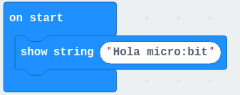

## [Iconos](https://makecode.microbit.org/_1fgT2wJfPfRm)

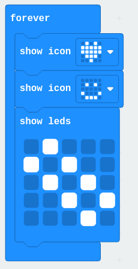

## [Dado](https://makecode.microbit.org/_erxD3veibFKp)

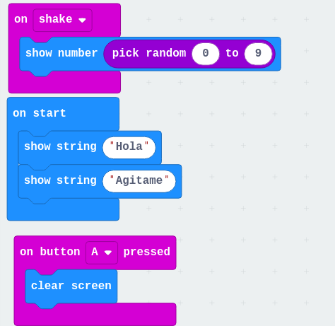

## [Termómetro](https://makecode.microbit.org/_Cvo0YaJdHhKq)

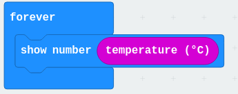

## [Dado v2](https://makecode.microbit.org/_W2d1cvabFJDp)

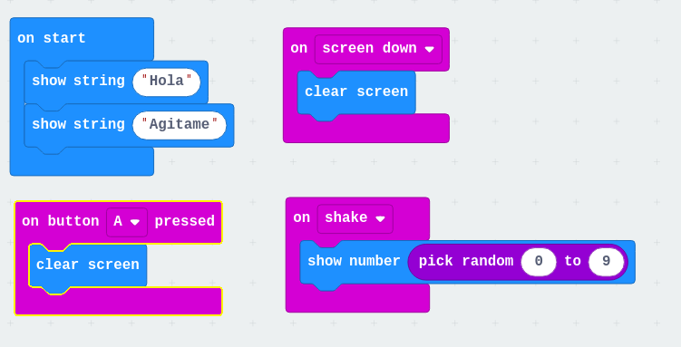

## [Termostado](https://makecode.microbit.org/_R81X2fiDU7Uy)

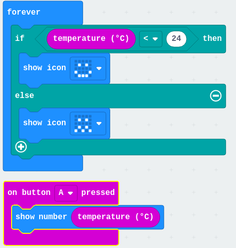

## [Control Nivel luminoso](https://makecode.microbit.org/_CpDfra1hDe37)

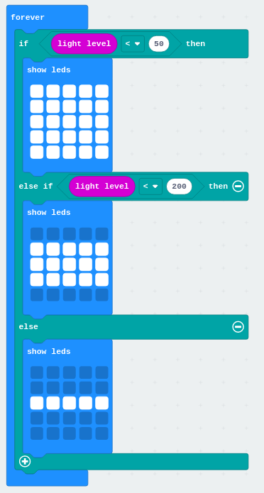

## [Control Nivel luminoso v2](https://makecode.microbit.org/_EKofv6UEfLYt)

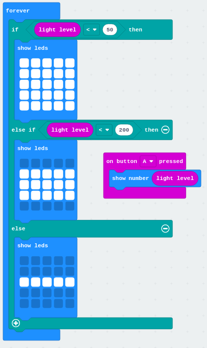

## [Control Nivel luminoso v3](https://makecode.microbit.org/_Hyxg4PPbTeux)

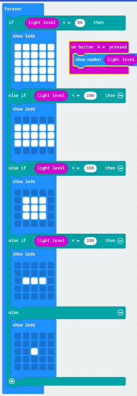

## [Gestos](https://makecode.microbit.org/_DujPH54rq0h2)

## [¿A quien le toca?](https://makecode.microbit.org/_4paTmUARmDdH)

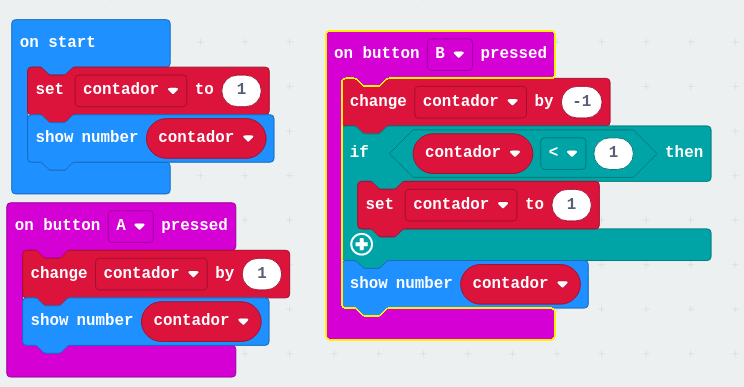

## [Tabla del 7](https://makecode.microbit.org/_guxTMaT4gDfA)

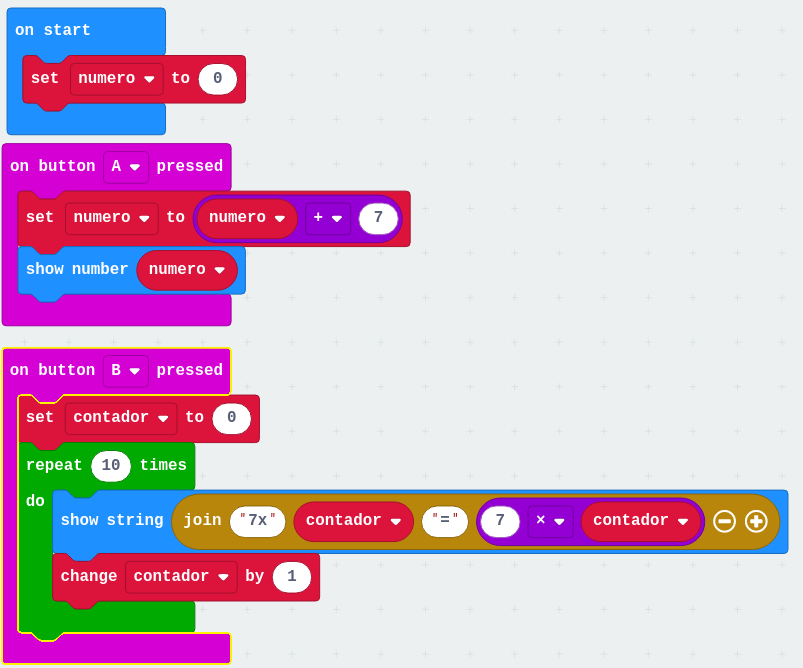

# Robot

## [Movimiento Sencillos Robot](https://makecode.microbit.org/_MLz0vWWh286t)

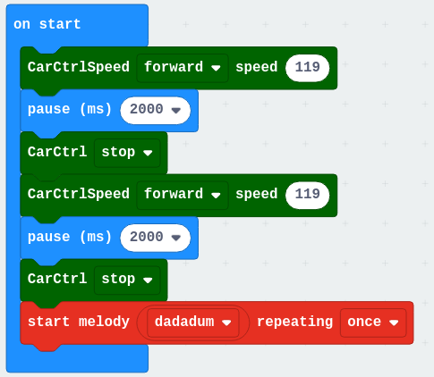

## [Botones](https://makecode.microbit.org/_6VMhyP5PogDV)

## [Sensores](https://makecode.microbit.org/_TH32AbJUeF4H)

[Luces colores](https://makecode.microbit.org/_6u1AeuhEEACU)